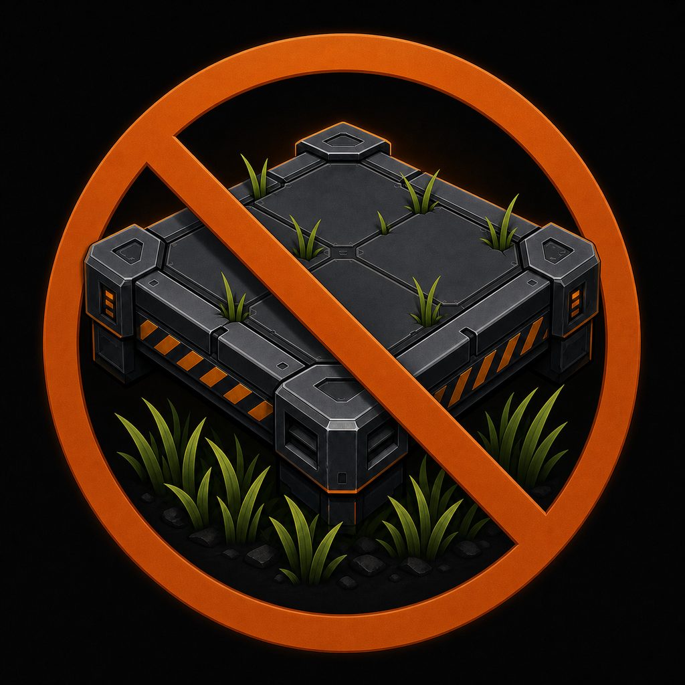

# No Grass Under Buildings 1.1.0

For Satisfactory 1.2

This mod hides grass beneath buildings and foundations. Ordinary grass, Unreal
Landscape Grass, and the separate render-only grass used by cliffs and pillars
are handled. By default, grass returns after the final covering building is
dismantled. Regrowth can be spread between a minimum and maximum delay. Grass
returns in staged edge-to-center waves across ordinary, landscape, and cliff
rendering. Touching pieces dismantled together, including zooped foundations,
share one continuous regrowth footprint.

This mod does not permanently remove trees, bushes, flowers, resource plants,
or other foliage. Satisfactory's normal building-placement and chainsaw rules
remain responsible for those objects.

## In-game configuration

Use SML's **Mod Configuration** screen and open **No Grass Under Buildings**.
The page provides:

- minimum and maximum grass-regrowth times
- gradual edge-to-center regrowth on/off
- horizontal and vertical grass-clearing buffers
- **Regrow grass after dismantling** on/off

When **Regrow grass after dismantling** is enabled, hidden grass returns after
the configured delay. Disable it before placing a building to save that grass
coverage as indefinitely cleared. This is non-destructive suppression: the mod
does not invoke permanent foliage-removal.

## Performance and multiplayer

The host records non-regrowing grass coverage in the save and replicates it to
clients. Clients perform local rendering work for ordinary, landscape, and
generated cliff grass. Large placement bursts are processed within a small
per-frame budget, persistent coverage lookups use a spatial index, and stale
generated-grass snapshots are released when their streamed components unload.

The mod is required on the host/server and connecting clients.

## Languages

The configuration page follows the game's selected language. It currently supports English, German, French, Spanish, Brazilian Portuguese, Polish, Russian, Simplified Chinese, Japanese, and Korean.

Translations are community-correctable. See [TRANSLATIONS.md](TRANSLATIONS.md) to improve wording or add another language.
